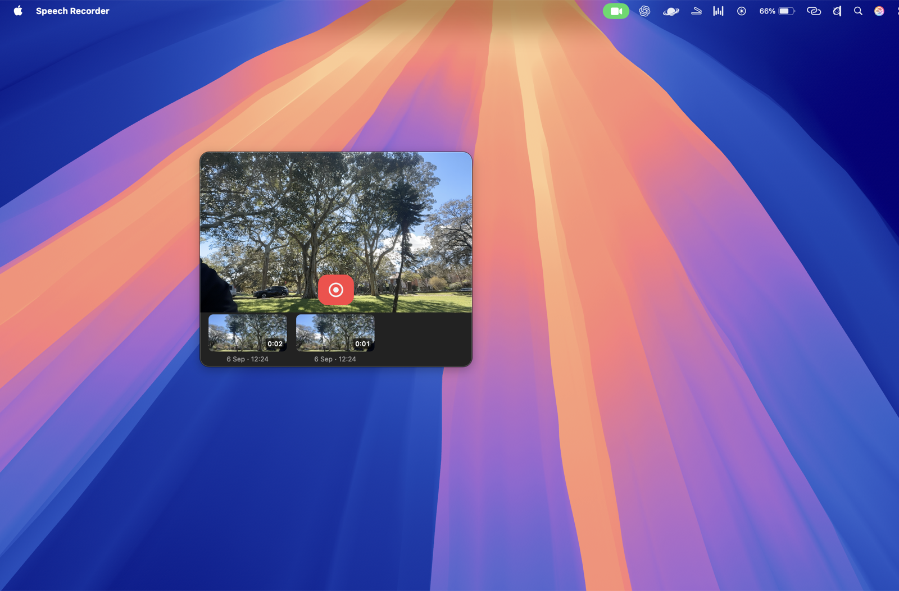
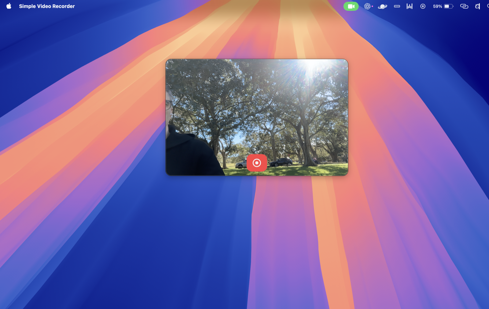

# Simple Video Recorder

A native macOS live mirror for speech practice, with a floating titleless window and local video recordings. Built with Swift, AppKit, AVFoundation, and AVKit; no third-party dependencies or network services.

<p align="center">
  
  
</p>
<p align="center"><em>Live preview · Recordings view</em></p>

## Build and open

Requires macOS 14 or later and Xcode command-line tools. From this directory:

```sh
./scripts/build.sh
open "/Applications/Simple Video Recorder.app"
```

The script creates a release build and an ad-hoc signed app bundle in `/Applications/Simple Video Recorder.app`. It refuses to rebuild while Simple Video Recorder is running. The app bundle is kept outside the synced Documents folder because file-provider metadata there caused strict signature verification to fail. Open `Package.swift` in Xcode to edit the source; use the bundled app to run with the correct camera/microphone permission descriptions. Rebuilding an ad-hoc signed application can cause macOS to request permissions again. Distribution to other Macs would need Developer ID signing and notarization.

## Use

- The live preview is mirrored; saved recordings use normal camera orientation.
- Drag the video picture in either live or playback mode to move the window and drag the edges to resize it. Position and size are saved.
- Click **Record**, allow microphone access, and click **Stop** to save.
- Click a thumbnail to play it. Press **Record** to stop playback, return to the camera, and begin a new recording. Press **Stop** to save and continue viewing the live camera automatically.
- Video fills the window by default. The icon-only **Record / Stop** button floats at the bottom center of the video. It appears while the pointer is over the video or the past-recordings strip is visible. Otherwise it hides when the pointer leaves. During recording, startup, and saving it remains visible regardless of pointer position. Status text appears when needed.
- Live video and playback fill their display area without side bars, preserving proportions and cropping excess edges when needed. Saved videos are unchanged.
- Past recordings start hidden on launch. Starting a recording hides the strip. Stopping and successfully saving a recording reveals it below the video again. Right-click the video in live or playback mode and choose **Show past recordings** or **Hide past recordings**. Empty libraries never leave a blank strip; the window adjusts its height when the strip appears or disappears.
- Thumbnails preserve image proportions and show dates beneath them. The selected recording has a blue thumbnail border. Dates and times appear with thumbnails; the playback controls do not show filenames.
- Select a recording and click the small **×** at the top-right of its thumbnail to move it to the macOS Trash. You can also right-click and choose **Move to Trash**. Restore accidentally deleted clips from Trash in Finder.
- Right-click a recording to reveal it in Finder.
- Close with ⌘W to stop camera and microphone capture and release playback resources. The app stays resident with some memory allocated; ⌘Q exits it completely. Reopen through the Dock or Spotlight. Quit with ⌘Q.
- Recordings are `.mov` files in `~/Movies/Simple Video Recorder`. Nothing is uploaded. Deletion moves recordings to the macOS Trash rather than permanently erasing them.

## Efficiency and lifecycle

The preview uses `AVCaptureVideoPreviewLayer` directly. The recording data-output connections are disabled during live preview; the native preview remains active without delivering recording samples or encoding. `AVAssetWriter` starts on the next video sample when Record is pressed, avoiding `AVCaptureMovieFileOutput` startup delay. Capture selects a 720p/30 fps camera format when available; recordings explicitly target 1280×720 H.264 at 2.5 Mb/s and AAC audio at 128 kb/s. Actual bitrate varies. The microphone input is attached when Record is pressed and removed when recording stops, including failure paths. This reduces idle capture work, with a possible recording-start latency tradeoff. No audio or video is written until Record is pressed. Playback and closing stop the camera; display/system sleep and inactive login sessions also suspend capture. Finished thumbnails and duration metadata are cached in `~/Library/Caches/local.hanskruger.SimpleVideoRecorder/Thumbnails`. Library refreshes reuse existing thumbnail buttons and loaded metadata; thumbnail loading is deferred while the strip is hidden. Changed files invalidate their cached display entries. Capture runtime errors finish any active writer and reset the recording controls and timer; failed outputs remain hidden for recovery.

Floating behavior uses AppKit window levels and collection behaviors, without repeatedly activating the app. Full-screen eligibility and system overlays remain controlled by macOS.

## Validation

The initial build was exercised on macOS 26.6.2 with a real camera: live preview, recording start/stop, a saved H.264/AAC movie, thumbnail display, playback, returning to Live, and library restoration after relaunch. The first recording revealed a 1080p camera default, leading to explicit format/output sizing and bitrate settings.

The installed build compiles without warnings and passes strict code-signature verification before and after launch. The stale microphone permission prompt was dismissed, and permission succeeded with the installed build. A 21.9-second test movie verified as 1280×720 H.264 at 30 fps and approximately 2.51 Mb/s, plus AAC audio at approximately 127 kb/s. Both streams decode successfully. Playback and returning to Live were exercised again. The earlier workspace app bundle should not be used.

The direct writer update was also tested: the first recording began in 0.458 seconds after permission, and a subsequent recording began in 0.040 seconds with the devices ready. These are measurements on this Mac, not a guaranteed bound. Both output files decode successfully with 1280×720 H.264 at 30 fps and AAC audio. Selection highlighting, filename-free playback, and moving a selected test recording to Trash were verified in the UI.

Further acceptance checks:

- Listen to a speech recording to assess perceptual audio/video synchronization. Stream presence, format, and decoding have been verified.
- Verify floating behavior over multiple Spaces/full-screen apps and across displays.
- Close/quit while recording and confirm the movie remains playable.
- Test denied permissions, camera disconnect, sleep/wake, and low disk space.
- Run a 30–60 minute preview, checking CPU, memory, and Energy Impact in Activity Monitor, and compare Photo Booth under the same lighting/camera/effects conditions. No measured battery-life improvement is claimed yet.

Command-W was verified after the layout update: the capture session reported stopped.

The app icon source, generated with the built-in image generator, and its full prompt are in `Assets/`. `scripts/build-icon.sh` creates the multi-resolution `.icns` asset. Playback dragging was verified by moving the window 130 points horizontally and 50 vertically; play/pause and seeking were also checked.

September 6 efficiency and error-recovery validation:

- Release build and strict app signature verification pass without compiler warnings.
- On-demand microphone starts measured 1.033 and 1.014 seconds after permission, compared with the earlier warm-input result of 0.040 seconds. These changes trade recording-start latency for less idle capture work; battery savings have not been measured.
- Two saved movies (approximately 51 and 16 seconds) contain 1280×720 H.264 video and AAC audio; both fully decode. Live preview, saving, updated thumbnails, selection, playback, quit, and relaunch were exercised in the installed app.
- A temporary synthetic-writer regression harness passed runtime errors before the first frame, during writing, and during finalization, checking a single completion and released writer state. A separate library harness verified retained button identity and metadata, insertion order, file-change invalidation, removal, hidden-strip loading deferral, and timer/busy-state cleanup.
- The final rebuilt app requested microphone permission again. After permission, the final recording smoke test saved successfully and its audio/video fully decoded. Command-W stopped capture.
